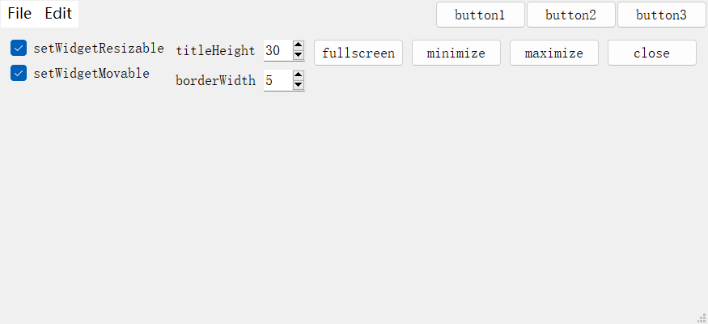
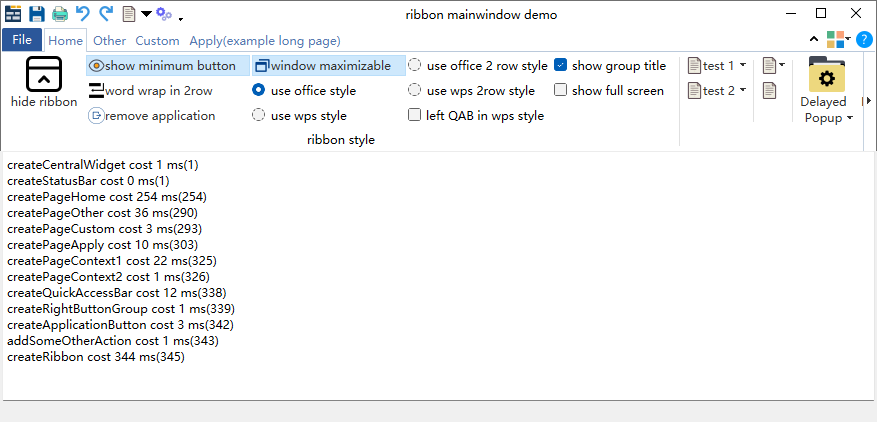

### 简介
qxframeless 是一种 Qt 无边框窗口的解决方案，力求代码简约，而功能不简单。

### 仓库
- github：[https://github.com/canpool/qxframeless](https://github.com/canpool/qxframeless)
- gitee：[https://gitee.com/icanpool/qxframeless](https://gitee.com/icanpool/qxframeless)

### 环境
- Qt 6.5.3 MinGW/MSVC2019 64bit
- Qt 5.15.2 MinGW/MSVC2019 64bit
- Qt 5.14.2 MinGW 64bit
- 其它环境未测试，推荐使用 [QT LTS](https://download.qt.io/official_releases/qt/) 版本

### 现状

**1）平台支持**

**Windows 平台**
- 支持 win10/11（注：其它未测试，需要看 WinApi 是否支持）
- 支持 Aero 特效（毛玻璃效果）
- 支持多屏（包含高分屏，高DPI屏）间移动不畸变（注：初始 DPI 值未真实获取）
- 支持 8 个方向调整大小（注：从左侧或上侧调整大小时，存在抖动）
- 支持默认显示在活动屏中

**Linux/Unix 平台**
- 暂不支持 native 特性

**MacOS 平台**
- 暂不支持 native 特性

备注：非 Windows 平台，尤其是 Linux 平台桌面情况太多，如果没有什么需求，暂时不打算支持 native 特性。

**2）构建支持**

- qmake
- cmake

### 协议
* 遵循 [MulanPSL2](./LICENSE) 开源许可协议

### 规范
* [Google C++ Style Guide](http://google.github.io/styleguide/cppguide.html)
* [Qt 编程风格与规范](https://blog.csdn.net/qq_35488967/article/details/70055490)
* 源文件全英文的采用 UTF-8 编码，包含中文的采用 UTF-8 with BOM 编码
* 代码 git 提交格式：[git 知：提交格式](https://blog.csdn.net/canpool/article/details/126005367)

### 贡献
* 欢迎提交 issue 对关心的问题发起讨论
* 欢迎 Fork 仓库，pull request 贡献
* 贡献者可在文件头版权中添加个人信息，格式如下：
```
/**
 * Copyright (C) YYYY NAME <EMAIL>
 * Copyright (C) 2023 maminjie <canpool@163.com>
 * SPDX-License-Identifier: MulanPSL-2.0
**/
```

### 交流
* QQ群：831617934（Qt业余交流）

### 例子
- <font size=4>framelesshelper</font>




### 案例

- <font size=4>ribbon mainwindow demo</font>



QxRibbon is a Qx componet like to Microsoft Ribbon style. For more information, please visit https://gitee.com/icanpool/qtcanpool

### 后语

欢迎广大 Qt 开源爱好者加入其中，乐在其中……
